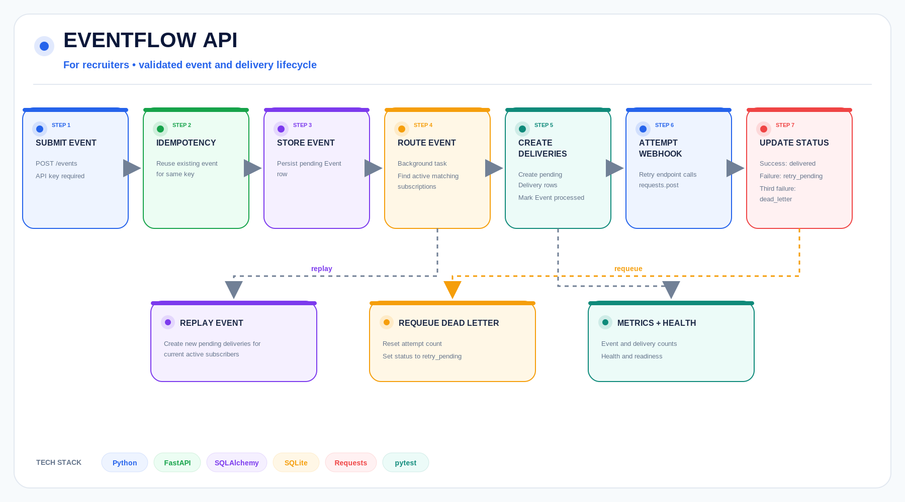
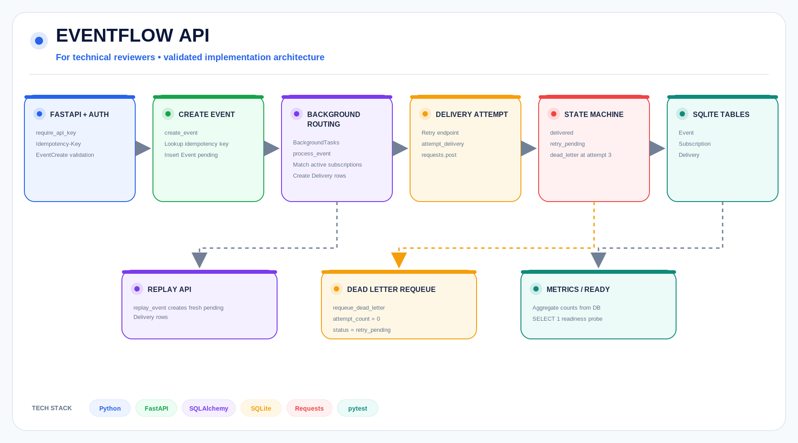

# EventFlow API Platform

Production style event ingestion and webhook delivery service with idempotency, subscriptions, persistence, retries, replay, dead letter recovery, and operational endpoints.


## What it does

EventFlow accepts application events through a typed FastAPI interface, authenticates requests with an API key, enforces idempotent ingestion, persists events, matches active webhook subscriptions, creates delivery records, tracks delivery attempts, retries failures, moves exhausted deliveries into a dead letter state, and supports replay and requeue operations.

The repository is designed as a production style backend systems project focused on API contracts, delivery state management, failure recovery, and operational visibility.

## System overview

For recruiters and nontechnical reviewers, this diagram shows the implemented event lifecycle.



The main lifecycle is:

```text
Send Event
Authenticate
Check Idempotency
Store Event
Match Subscribers
Create Delivery Records
Attempt Delivery
Retry or Dead Letter
```

Replay and dead letter requeue are management operations that operate on persisted event and delivery state.

## Technical architecture

For technical reviewers, this diagram shows the implemented API, persistence, routing, delivery, and recovery layers.



## Execution flow

1. A producer sends an event to FastAPI.

2. The API validates the request using the configured API key.

3. If an `Idempotency-Key` is supplied, the service checks whether that key already exists.

4. If the key already exists, the previously stored event is returned instead of inserting a duplicate.

5. A new event is persisted through SQLAlchemy.

6. Background event processing matches active subscriptions for the event type.

7. Pending delivery records are created for matching subscriptions.

8. The event is marked as processed after delivery records are created.

9. Delivery attempts send HTTP POST requests to subscriber targets.

10. Successful attempts transition to the delivered state.

11. Failed attempts transition back to retry pending while attempts remain.

12. After the configured attempt limit is reached, the delivery transitions to dead letter.

13. Replay creates fresh delivery records for an existing event using currently active matching subscriptions.

14. Dead letter requeue resets a failed delivery so it can return to the retry path.

## Key capabilities

1. Typed REST API design

2. API key authentication

3. Idempotent event ingestion

4. Persistent event storage

5. Webhook subscriptions

6. Background subscription matching

7. Delivery record persistence

8. Delivery attempt tracking

9. Retry state management

10. Dead letter handling

11. Event replay

12. Dead letter requeue

13. Subscription lifecycle management

14. Filtering and pagination

15. Operational metrics

16. Health endpoint

17. Readiness endpoint

18. SQLAlchemy persistence

19. SQLite development storage

20. PostgreSQL ready ORM design

21. Automated tests

22. Docker support

## Quick start

```bash
python3 -m venv .venv
source .venv/bin/activate
pip install -r requirements.txt
pytest -q
uvicorn app.main:app --reload
```

Open:

```text
http://127.0.0.1:8000/docs
```

for the interactive FastAPI contract.

## Authentication

The default development API key is:

```text
dev-secret-key
```

Send it using:

```text
X-API-Key
```

Example:

```bash
curl -X POST http://127.0.0.1:8000/events \
  -H "Content-Type: application/json" \
  -H "X-API-Key: dev-secret-key" \
  -H "Idempotency-Key: customer-created-001" \
  -d '{
    "event_type": "customer.created",
    "source": "crm",
    "payload": {
      "customer_id": "cus_123",
      "plan": "premium"
    }
  }'
```

## Example event

```json
{
  "event_type": "customer.created",
  "source": "crm",
  "payload": {
    "customer_id": "cus_123",
    "plan": "premium"
  }
}
```

## Idempotency

Send an idempotency key using:

```text
Idempotency-Key
```

If the same event request is sent again with the same idempotency key, EventFlow returns the original stored event rather than inserting another event row.

This protects producers from creating duplicate events during client retries or network uncertainty.

## Subscription routing

Subscriptions define webhook targets and the event types they receive.

When an event is processed, EventFlow:

```text
loads active subscriptions
matches subscriptions by event type
creates pending delivery records
marks the event processed
```

Delivery state is persisted separately from event state so each subscriber can have its own delivery outcome.

## Delivery lifecycle

A delivery moves through explicit states.

```text
pending
retry_pending
delivered
dead_letter
```

Successful webhook delivery transitions the record to:

```text
delivered
```

Failed attempts remain retryable until the attempt threshold is reached.

After the final allowed failed attempt, the record transitions to:

```text
dead_letter
```

## Replay

Replay is an event level recovery operation.

It creates new pending delivery records for an existing event using the currently active matching subscriptions.

This allows an event to be delivered again without rewriting the original event.

## Dead letter requeue

Dead letter requeue operates on an individual failed delivery.

The operation resets its delivery attempt state and returns it to the retry path.

This gives operators a recovery mechanism after correcting an external webhook problem.

## API surface

The platform includes operational endpoints for:

```text
events
subscriptions
deliveries
retries
replay
dead letters
metrics
health
readiness
```

The exact request and response contracts are available through the generated FastAPI documentation.

## Persistence model

SQLAlchemy manages the primary persisted resources.

```text
events
subscriptions
deliveries
```

Events retain the producer payload and processing state.

Subscriptions retain webhook routing configuration.

Deliveries retain subscriber specific delivery state, retry information, and failure outcomes.

The default local configuration uses SQLite while keeping the persistence layer structured for a relational production database.

## Operational visibility

The service exposes operational information for the event pipeline, including counts and status information for events, active subscriptions, pending deliveries, successful deliveries, and dead letter records.

It also exposes health and readiness endpoints for deployment verification.

## Tests

Run:

```bash
pytest -q
```

Current repository status:

```text
11 passing
```

## Deployment

The repository includes Docker and Render configuration.

The service exposes:

```text
/health
```

for platform health checks and includes readiness support for operational verification.

## Tech stack

```text
Python
FastAPI
Pydantic
SQLAlchemy
SQLite
Requests
pytest
Docker
```

## Recruiter summary

Built a production style event processing API with typed contracts, API key authentication, idempotent ingestion, persistent event storage, webhook subscriptions, delivery state tracking, retry handling, dead letter recovery, event replay, operational metrics, health checks, and automated integration tests.
